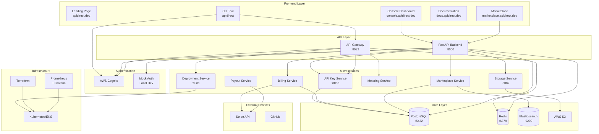

# API-Direct Platform Architecture

## 🏗️ Complete System Architecture



## 📊 Component Interactions

### 1. **User Journey - Creator Publishing an API**

```
Creator → CLI → Auth (Cognito) → Gateway → Deployment Service → Kubernetes
                                      ↓
                                Storage Service → S3
                                      ↓
                                Marketplace Service → PostgreSQL
```

### 2. **User Journey - Consumer Using an API**

```
Consumer → API Call → Gateway → API Key Service (validate)
                          ↓
                    Metering Service (track usage)
                          ↓
                    Deployed API (Kubernetes)
                          ↓
                    Response → Consumer
```

### 3. **Billing Flow**

```
Metering Service → Usage Data → Billing Service → Stripe
                                      ↓
                                Payout Service → Creator Bank Account
```

## 🔧 Service Responsibilities

### **Frontend Applications**
| App | Purpose | Technology | Status |
|-----|---------|------------|---------|
| Landing | Marketing site | HTML/JS/Tailwind | ✅ Deployed |
| Console | Creator dashboard | HTML/JS | ✅ Deployed |
| Marketplace | API discovery | Next.js 14 | ✅ Deployed |
| Docs | Documentation | Static HTML | ✅ Deployed |

### **Core Services**
| Service | Port | Purpose | Language |
|---------|------|---------|----------|
| FastAPI Backend | 8000 | Main orchestration | Python |
| API Gateway | 8082 | Request routing | Go |
| Storage | 8087 | Code packages | Go |
| API Key | 8083 | Key management | Go |
| Deployment | 8081 | K8s deployment | Go |

### **Business Services**
| Service | Purpose | Integration |
|---------|---------|-------------|
| Billing | Subscriptions | Stripe |
| Metering | Usage tracking | Redis/PostgreSQL |
| Payout | Earnings | Stripe Connect |
| Marketplace | Discovery | Elasticsearch |

## 🚀 Deployment Modes

### **Local Development**
```bash
# Everything runs locally with Docker
./start-platform.sh

# Uses:
# - Mock authentication
# - Local PostgreSQL/Redis
# - No AWS dependencies
```

### **Production**
```bash
# Terraform provisions AWS infrastructure
cd infrastructure/terraform
terraform apply

# Kubernetes deploys all services
kubectl apply -f infrastructure/k8s/

# Uses:
# - AWS Cognito auth
# - RDS PostgreSQL
# - ElastiCache Redis
# - EKS for containers
```

## 📈 Data Flow Examples

### **API Deployment Flow**
1. Creator runs `apidirect deploy`
2. CLI authenticates with Cognito
3. Code uploaded to Storage Service → S3
4. Deployment Service creates K8s resources
5. API becomes available at gateway endpoint
6. Marketplace Service indexes new API

### **API Usage Flow**
1. Consumer gets API key from console
2. Makes request to `api.apidirect.dev/api-name/endpoint`
3. Gateway validates API key
4. Gateway routes to deployed API
5. Metering Service records usage
6. Response returned to consumer

### **Billing Cycle**
1. Metering Service aggregates usage daily
2. Billing Service calculates charges
3. Stripe processes payments monthly
4. Payout Service distributes earnings
5. Creators receive payments

## 🔐 Security Layers

1. **Authentication**: AWS Cognito JWT tokens
2. **API Keys**: Per-consumer rate limiting
3. **Network**: VPC isolation, security groups
4. **Data**: Encryption at rest and in transit
5. **Monitoring**: Prometheus alerts for anomalies

## 📊 Monitoring & Observability

### **Metrics Collected**
- API request rates and latencies
- Error rates by service
- Business metrics (revenue, users, APIs)
- Infrastructure health
- Cost optimization data

### **Dashboards Available**
- Marketplace Overview
- Creator Analytics
- System Health
- Business KPIs
- Cost Analysis

## 🎯 Current Implementation Status

| Component | Built | Tested | Deployed | Production Ready |
|-----------|-------|---------|----------|------------------|
| CLI Tool | ✅ | ✅ | ✅ | ✅ |
| Frontend Apps | ✅ | ✅ | ✅ | ✅ |
| Backend API | ✅ | ✅ | 🔧 | ✅ |
| Microservices | ✅ | ✅ | 🔧 | ✅ |
| Infrastructure | ✅ | ✅ | ❌ | ✅ |
| Monitoring | ✅ | ✅ | ❌ | ✅ |
| Documentation | ✅ | ✅ | ✅ | ✅ |

Legend: ✅ Complete | 🔧 Local only | ❌ Not deployed

## 🚦 Quick Start Commands

```bash
# Start everything locally
./start-platform.sh

# Test the platform
./test-platform.sh

# Deploy a sample API
cd examples/weather-api
apidirect deploy

# View logs
docker-compose logs -f

# Access services
open https://console.apidirect.dev
open http://localhost:8000/docs
open http://localhost:3000  # Grafana
```

The platform is **feature-complete** and ready for production deployment!